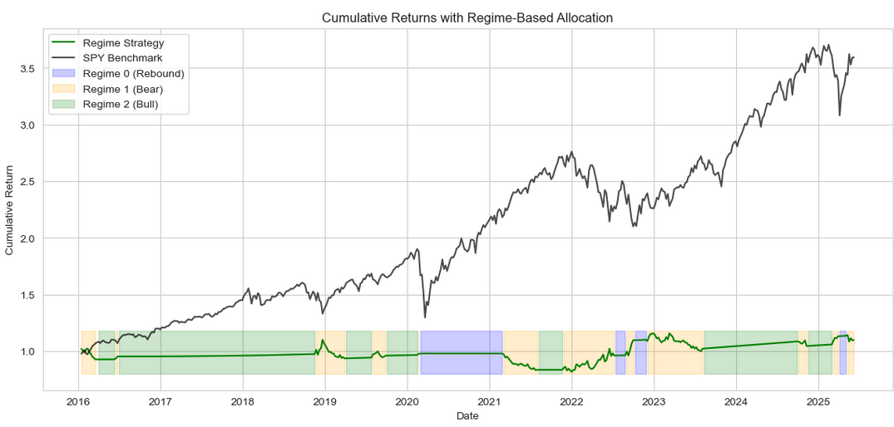
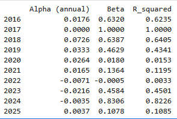
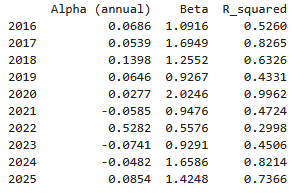

# Hidden Markov Model Classification for Equity Regime Detection
This project implements a regime classification framework for equity markets using a Gaussian Hidden Markov Model.
The goal is to identify distinct market regimes (e.g., rebound, bear/crash prone, bull) and design regime-specific portfolio allocations.

---

## Table of Contents
- [Overview](#overview)
- [Gaussian Hidden Markov Model](#gaussian-hidden-markov-model)
- [Methodology](#methodology)
- [Data](#data)
- [Usage](#usage)
- [Results](#results)
- [Next Steps](#next-steps)
- [Important Functions](#important-functions)
- [Results of Different Portfolios](#results-of-different-portfolios)
- [References](#references)

---

## Overview
- Identifies historical market regimes using a Gaussian Hidden Markov Model on market/technical features.  
- Profiles each regime based on return distributions, volatility, and technical signals.  
- Backtests simple regime-aware allocation rules (e.g., shift to cash in crash-prone regime).  
- Evaluates performance metrics such as Sharpe ratio, drawdowns, alpha, and beta relative to the S&P 500.
- Trains on interval from 1994-2015 and evaluates on backtest from 2016-2025.

---

## Gaussian Hidden Markov Model
- A **Hidden Markov Model (HMM)** is a statistical/machine learning model that describes how systems evolve over time when the underlying state is not directly observable (it is "hidden") but must be inferred from observable data. I use a **Gaussian HMM** which assumes the observed data for each hidden state follows a multivariable Gaussian distribution.
1. **Key Ideas**
   - **Hidden States (my Regimes):** The market can be in different unobserved (you can't see them directly just by looking at S&P closing prices) regimes (rebound, bear, bull). Each state has its own probability distribution governing returns and volatility.
   - **Transition Probabilities:** The likelihood of moving from one regime to another is modeled with a transition matrix, which captures persistence or switching between states.
   - **Gaussian Emissions:** For each hidden state, returns are modeled as coming from a Gaussian distribution.
   - **Training:** Given a sequence of observed returns and volatility, the HMM uses the Baum-Welch algorithm to find the transition matrix.
   - **Inference:** With the transition matrix from the Baum-Welch algorithm, the HMM then uses the Viterbi algorithm to find the most likely sequence, and from this we get our regimes. The transition matrix found from the training data is applied to the testing data to prevent overfitting.
   
2. Why did I use this model for equity markets?
   - Financial markets often exhibit regime-switching behavior where return distributions switch over time. A Gaussian HMM is fit to capture these dynamics and classify them into discrete regimes.

---

## Methodology
1. **Feature Engineering**  
   - Technical indicators (e.g., RSI, moving averages).  
   - Market returns and volatility estimates.
   - Settled on a feature set of past week return, past month return, VIX (volatility index), Price-to-200-day moving average, 20-day exponential moving average of Relative Strength Index, and Price-to-20-day exponential moving average. 

2. **Classification**  
   - Gaussian HMM applied to standardized features.  
   - Each state represents a distinct regime.

3. **Regime Profiling**  
   - Compute average feature values and frequency of each regime.  
   - Visualize regimes over time relative to the S&P 500.
   - Regimes named based on their profiles (e.g. "bull" characterized by relatively low volatility and positive returns).

4. **Backtesting**  
   - Map each regime to a portfolio allocation (`SPY`, `BIL`, `MTUM`,`SPUU`,`SH`,`SPXU`).  
   - Compute performance metrics including CAGR, Sharpe, Calmar, and alpha/beta.  

---

## Data
- **S&P 500 Index (SP500)**: Benchmark returns.  
- **Treasury Yield (WGS3MO, FRED)**: Used to estimate the risk-free rate.  
- **ETFs**: Price data for SPY, BIL, MTUM, SPUU, SH, SPXU. SPY is used to track S&P500 closing prices. BIL is 1-3 month gov't bonds. MTUM is momentum factor stocks ETF. SPUU is S&P 2x long etf. SH is S&P 1x short ETF. SPXU is S&P 2x short ETF.
- Each ETF's closing price data assumes any payout (dividends, interest income) is reinvested back into the instrument.

---

## Usage
- Use this link to access the notebook:  (make sure to open in a new tab)
- You can edit the features of interest, the regime-to-portfolio mapping, and the regime confirmation period hyperparameter
- I would use caution picking a new ETF or asset to use during a given regime since you expose yourself to overfitting to the test set. For safety, the higher r-squared the asset has with SPY, the better (aside from short-dated gov't bonds, of course).
- Changing a feature around likely will require you to ascribe a name to each regime the model predicts. For example, in my code, 0 -> Rebound, 1 -> Crash-prone, 2 -> Bull, but these very well may shuffle around if you change the features.
- You can also tune the hyperparameter for number of regimes to detect.

---

## Results
- I found that with my set of features, the model successfully modeled 3 distinct regimes: Rebound, Bear/crash-prone, and Bull. Each regime-to-portfolio mapping is predicated on the idea that you decrease your market risk (beta) when the market is crash-prone and increase it when the market is in a positive regime.
- There are many different combinations of allocations one can choose, but the one I chose as most realistic with a balance of returns and volatility was increasing momentum factor (MTUM) during "Rebound" regime, going completely risk-free (BIL) during "Bear/crash-prone" regime, and index (SPY) during "Bull" regime. This strategy (SPY) achieved 16.9% (15.0%) CAGR since 2016, with a Sharpe ratio of .91 (.75), and with annual alpha of 5.27% (0%). The strategy's Beta was .72 (0).
- Certain strategies involving shorting the market during its Bear/crash-prone phase provided worse returns, but they performed extremely well in decreasing the strategy's beta. One such example is using the same allocations as above but shorting the market (SH) during the Bear/crash-prone phase. During the same period, this strategy achieved CAGR of 15.8%, Sharpe of .75, annual alpha of 9.2%, with beta of .42. While alpha was higher, this shows the models inherent tradeoff between returns and volatility. This is another reason why I chose the above allocation (MTUM, BIL, SPY) as the most realistic: Shorting the market during 2021 proved devastating, though these losses were more than wiped away when the strategy excelled in 2022 (55% alpha, -.53 beta).
- For a fund manager looking to decrease their beta, shorting the market during crash/bear would provide a compelling solution. Shorting the market during the Bear/crash-prone regime and sitting in BIL otherwise had a CAGR of 1%, but with its beta of -.31 it posted an annual alpha of 3.6%. Given SPY has a quite low borrow rate estimated at ~.25%, this strategy would provide a robust source of funds.
- [Below](#results-of-different-portfolios), I have included photos of each of the previously mentioned allocations versus the market plus tabular results. I added various other possible portfolios. You will notice that further increasing risk during the Rebound phase (such as with SPUU) raises the possibility of huge downswings when the model is occasionally wrong (sell-off during Rebound phase), but these losses end up being erased by larger gains.
- Overall, the model's success hinges on whether it can determine there is too much risk in the market or not. It shows robust ability to do so, as evidenced by superior risk-adjusted returns throughout various portfolios.
- Directly below are photos of the regimes overlayed over the S&P for both the train and the test sets.

---

## Next Steps
- I plan on considering individual stocks/industries next. One important consideration for this route is the effect of upcoming catalysts. I largely looked past this (assumed any significant effect of this factor would be priced into VIX) since this levels out for an index fund.
- Another interesting path would be creating a model that learns which factors inform your regime. There is an inherent tradeoff here between efficacy and interpretability, since an LSTM architecture could be useful for predicting a regime, but this may be of little use to a fund manager, eager to adjust their beta, who would have little way of gaining insight into why the model makes a given prescription.
- A useful addition to the project would be creating a function that solves for a regime-to-portfolio mapping given a desired beta. This would be useful to a fund manager who wants a specific beta but is unsure of how to achieve this through a mapping given we cannot know the regime going forward.

---

## Important Functions
1. **Calculating Annual Alpha:** I calculated annual alpha by first running an ordinary least-squares regression where my weekly portfolio returns are the Y axis, and the market returns are on the X axis. The slope of this line is the strategy's beta, and the y-intercept is the alpha. This gives weekly alpha, so to put it into annual terms, I make the following assignment: alpha_ann = (1 + alpha_weekly)**52 - 1. This code can be viewed <a href="docs/alpha"><u>here</u></a>.
2. **Calculating Risk-free Rate:** One important input into my alpha calculation is the risk-free rate. I decided to choose the risk free rate as the average 3-month T-bill yield from FRED's WGS3MO CSV. This gets average annualized yield, but I needed average weekly yield for my calculation, so I make the following assignment: rf_weekly = (1 + avg_ann) ** (1/52.0) - 1. This code can be viewed <a href="docs/rf"><u>here</u></a>. This method can be checked against the S&P, and it confirms with alpha = 0.
3. **Look-Ahead Bias?**: It's important to show my strategy doesn't include look-ahead bias, as that would make it worthless. However, every date, portfolio weights are chosen based only on the regime classification known at that date, and strategy returns are then calculated sequentially. No future information is ever used when making allocation decisions, so the backtest is free from forward-looking bias. Code to prove this can be viewed <a href="docs/lookahead"><u>here</u></a>.
4. **Calmar Ratio**: One metric I included in my stats was the Calmar ratio. Calmar ratio is a risk-adjusted return metric taking into account CAGR and maximum drawdown. It is calculated as CAGR/max drawdown. I decided to include this because some strategies have superior return metrics but very high maximum drawdown. For example, in 

---

## Results of Different Portfolios
- Photos on how different regime-to-allocation mappings performed
- In each strategy note that 0 is Rebound, 1 is Bear/crash-prone, and 2 is Bull.
### Strategy 1: 0: MTUM, 1: BIL, 2: SPY

### Strategy 2: 0: MTUM, 1: SH, 2: SPY

### Strategy 3: 0: BIL, 1: SH, 2: BIL

### Strategy 4: 0: BIL, 1: BIL, 2: SPY

### Strategy 5: 0: BIL, 1: BIL, 2: SPUU

### Strategy 6: 0: BIL, 1: SPXU, 2: BIL

### Strategy 7: 0: SPUU, 1: BIL, 2: SPUU

### Strategy 8: 0: SPUU, 1: SPXU, 2: SPUU

---

## References

